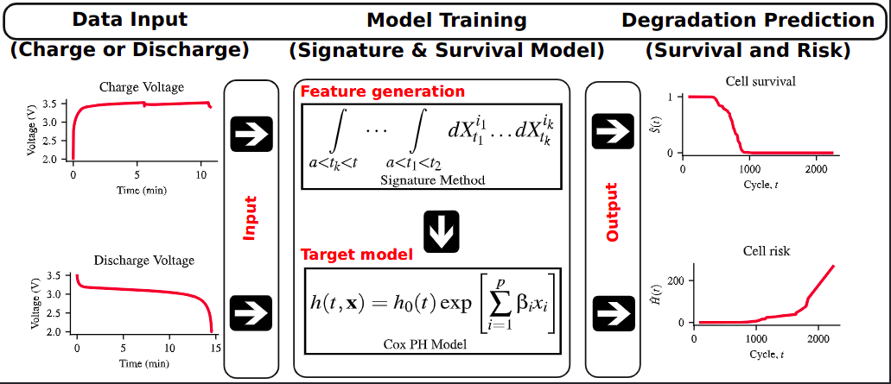

# battery-survival
This repository contains all the codes for modelling and experiments performed in a research that focuses on the use of charge and discharge voltage profiles for the prediction of survival probability and hazard functions of Li-ion cells. Two models were proposed based on whether
they use features extracted from charge or discharge data regime: the charge, and discharge models. Path signature was used as feature extraction technique.

Below is the graphical abstract of the project, illustrating the modelling steps:



## Set up
1. Clone the repository by running
    ```
    git clone https://github.com/Rasheed19/battery-survival.git
    ```
1. Navigate to the root folder, create a python virtual environment by running
    ```
    python -m venv .venv
    ```
    Note that Python 3.10.15 was used in this research.

1. Activate the virtual environment by running
    ```
    source .venv/bin/activate
    ```
1. Prepare all modules and required directories by running the following:
    ```
    make setup
    make create-required-dir
    ```

## Usage
This project is broken down into pipelines which allow for reproducibility, customization and ease of use. The following are the various pipelines that can be run from your local development environment.

1. `download`, run the download pipeline to download the data used for modelling and experimentations:
    ```
    python run.py --pipeline download
    ```
1. `eda`, run the EDA pipeline to perform exploratory data analysis on the dowloaded data. If you are running this pipeline for the first time, you need to give the flag `--not-loaded`. This flag will load the downloaded data into a python dictionary and will get data ready for the exploartion:
    ```
    python run.py --pipeline eda --not-loaded
    ```
1. `training`, run the training pipeline to train models. Two models were proposed; the `charge` and `discharge` model. To run any of these you need to give the `--regime` argument. For instance if you want to run the charge model, run
    ```
    python run.py --pipeline training --regime charge
    ```

1. `sig-effect`, run the signature effect pipeline to experiment with the efect of different signature depth on the proposed models' performance:
    ```
    python run.py --pipeline sig-effect
    ```
1. `num-cycle-effect`, run the cycle number effect pipeline to experiment with the efect of different cycle number thresholds on the proposed models' performance:
    ```
    python run.py --pipeline num-cycle-effect
    ```

1. `data-increment-effect`, run the data increment effect pipeline to experiment with the efect of different training samples on the proposed models' performance:
    ```
    python run.py --pipeline data-increment-effect
    ```
1. `low-cycle-prediction`, run the low-cycle prediction pipeline to investigate the effect of using various number of cycle data models' performance at inference time:
    ```
    python run.py --pipeline low-cycle-prediction
    ```
1. `sparsity-robustness`, run the sparsity robustness pipeline to investigate the effect of different degree of voltage curve sparsity on models' performance. Two sparsity levels were proposed: (i) sparsity at training data level, and (ii) sparsity at test data level. To run this experiment, you must provide additional argument via the flag `--sparsity-level`. This flag takes either `train` or `test` to run the experiment for sparsity at the training or test data level respectively. For instance, for `train`, run:
    ```
    python run.py --pipeline sparsity-robustness --sparsity-level train
    ```
Note that all generated plots and data after running any of the pipelines above will be stored in `plots` and `data` folder respectively with appropriate tags for ease of identification. To see help for running the pipelines, run:
```
python run.py --help
```
